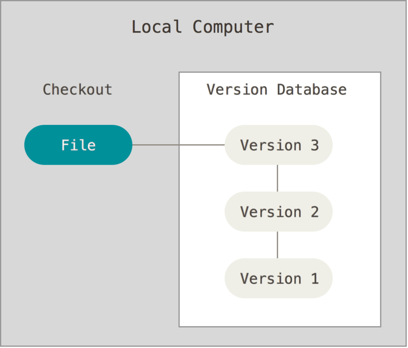
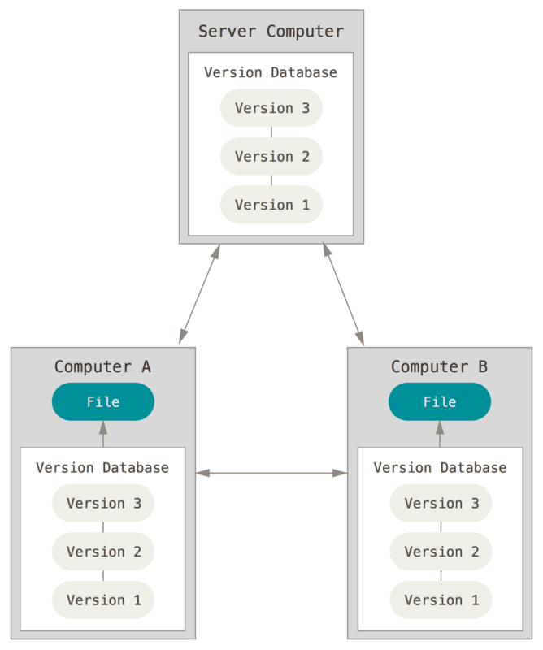

# vcs 란 무엇인가?
----
vcs란 버전관리 시스템의 약자로 파일변화를 시간에 따라 기록했다가 나중에 특정 시점의 버전을 다시 불러올수 있는 시스템음 의미한다.
vcs를 사용하면 선택한 파일을 이전 상태로 되돌릴 수 있고, 변경사항을 비교하고, 변경한사람 및 변경 시기를 추적할수 있다.
vcs는 특히 여러 개발자들이 협업하는 과정에서 중요한데  vcs의 장점은
1. 여러 개발자들이 협업할 경우 특정 코드가 추가된 히스토리를 관리하기 편하다
2. 여러 개발자들이 형벙할 때 코드를 병렬적으로 수정하고 합칠수 있다.
3. 여러 기능들이 병렬적으로 개발될 수 있다.
4. 특정 버전에서 문제가 생겼을 경우 해당 문제가 일어난 부분을 찾기위해 이전 버전의 코드를 쉽게 찾을수 있다.
5. 추가된 코드를 시스템 적으로 되돌릴수 있어 오류를 줄일수 있다.     

라는 장점이 있다.
그리고 vcs종류에는 대표적으로 Local vcs와 CVCS , DVCS가 있는데
### Local vcs
Local vcs 는 간단히 데이터 베이스를 사용하여 파일의 변겅 정보를 관리하는 시스템입니다.
아주 간단하지만 실수하기 쉽다는 단점이 있다.

### CVCS
중앙 집중식 버전 관리 시스템으 서버가 별도로 있고 클라이언트가 중앙서버에서 파일을 받아서 사용하는 방법이다.
로컬 VCS보다 관리가 쉽다는 장점이 있지만 중앙서버에 문제가 발생한다면 치명적이라는 단점이 있다

### DVCS
분산 버전관리 시스템으로 파일의 마지막 스냅샷을 사용하지 않고 저장소를 히스토리와 더불어 전부 복제한다.
서버에 문제가 생기면 이 복제물로 다시 작업을 시작할수 있고 클라이언트 중에서 아무거나 골라서 서버를 복원할 수도 있다.     
또한 많은 수의 리모트 저장소를 가질수 있기 때문에 다양한 방법으로 협업할수 있다.     

